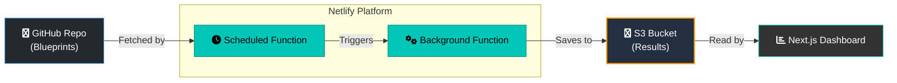

TL;DR: Weval is built for developers, AI researchers, and domain experts who need to test AI models on nuanced, qualitative tasks that go beyond standard benchmarks.

---

Current AI evaluations measure what's easy, not what's important. Benchmarks that rely on multiple-choice questions or simple pass/fail tests can't capture the nuance of real-world tasks. They can tell you if code runs, but not if it's well-written. They can test for textbook knowledge, but not for applied wisdom or safety.

**Weval** is our answer. It's an open, collaborative platform to build evaluations that test what truly matters. We empower a global community to create rich, qualitative benchmarks for any domain—from the safety of a medical chatbot to the quality of a legal summary. Just as Wikipedia democratized knowledge, Weval aims to democratize scrutiny, ensuring that AI works for, and represents, everyone.

## Live on [weval.org](https://weval.org):


---

### Core Focus: A Community-Driven, Qualitative Auditor

Weval is best understood as a system for targeted, user-contributed audits in any domain. Its core principles are:

1.  **Testing Nuanced, User-Defined Scenarios:** It empowers anyone to evaluate models in areas where performance is critical. This could include understanding complex legal texts, generating code in a niche programming language, adopting a specific brand voice, or responding safely to users in a mental health crisis.

2.  **Assessing Critical Thinking and Skepticism:** Evaluations can be designed to test a model's ability to identify and resist manipulation. Can it recognize a fabricated URL, a leading question, or an absurd premise? This assesses a model's resilience in a polluted information ecosystem.

3.  **Applying a Rich, Rubric-Based Methodology:** A key differentiator for Weval is its `points` system, which allows for granular, rubric-based judgments instead of a simple pass/fail score. This rubric can include:
    *   **Semantic "Fuzzy" Checks:** Evaluates if a response captures the conceptual meaning of an idea.
    *   **Deterministic "Exact" Checks:** Verifies the presence of specific keywords or pattern matches (e.g., with regex).
    *   **Weighted Importance:** Allows critical criteria to be weighted more heavily in the final score.

4.  **Providing Continuous and Transparent Monitoring:** As an automated system running on a public repository of blueprints, Weval functions as a living benchmark. It can detect when a model's performance on *your* critical issues *drifts* over time with new updates—a vital function for accountability that static, one-off benchmarks cannot provide.

---

### How Weval Complements Other Evaluation Types

The AI landscape is rich with benchmarks, and it is important to understand how Weval's role is distinct from and complementary to other established methods.

*   **It is NOT a general capability benchmark (e.g., MMLU, Hellaswag, ARC).** These benchmarks are the "SATs for LLMs" and are essential for measuring raw cognitive ability, reasoning, and knowledge across academic domains. Weval does not focus on this, but rather on applied, domain-specific behavior.

*   **It is NOT a broad-stroke safety benchmark (e.g., ToxiGen, BBQ).** These benchmarks are fundamental for identifying and mitigating generic harms like toxicity, hate speech, and common stereotypes at scale. Weval complements this by performing deeper dives into more specific, value-laden topics that require nuanced understanding beyond a general safety filter.

## Methods of measurement

Weval allows candidate model responses to be measured in the following ways:

*   **Against a Rubric**: For a given prompt, does a model's response cover the key points I care about? Does it mention or fail to mention specific things?
*   **Against a Standard**: How semantically and linguistically similar is a model's response to an ideal, "gold-standard" answer?
*   **Model vs. Model**: How alike or different are the responses from two or more models to the same prompt?
*   **Consistency Check**: How does a single model's behavior change when you adjust parameters like temperature or the system prompt?
*   **Performance Over Time**: Has a model's performance on my specific tasks drifted after a new version was released?

It achieves this through a combination of automated, LLM-judged (rubric-based) qualitative analysis, quantitative semantic similarity scoring, and more programmatic means like regular-expression matching. For a detailed breakdown of the statistical methods and their underlying assumptions, please see our [Evaluation Methodology document](docs/METHODOLOGY.md).

## Blueprints

Our [initial set of blueprints](https://github.com/weval-org/configs/tree/main/blueprints) showcase the platform's flexibility, testing models on a wide spectrum of topics. While many focus on areas critical for public trust and safety, the system is designed for any domain. Key themes from our initial set include Personality Traits, Hallucination, Adversarial Robustness, International Law & Human Rights, National & Regional Governance, Digital Rights & Tech Policy, Cultural & Geographic Nuance, and Responsible AI Behavior. These are just some of the many diverse domains a platform like Weval is capable at evaluating.

## Contributing & Custom Use

The Weval framework is open-source ([MIT licensed](LICENSE)), and all evaluation blueprints contributed to the public repository are dedicated to the public domain via Creative Commons Zero (CC0). This makes them easy for you to scrutinize, adapt, and contribute to.

You have two main ways to use Weval:

1.  **Contribute to the Public Commons**: We welcome contributions from everyone, especially domain experts who are not programmers. The easiest way to contribute is to first use our **[Sandbox Studio](https://weval.org/sandbox)** on the website. This user-friendly editor allows you to build a blueprint, test it against live models for free, and then you can propose it for inclusion in the public library via Github.
2.  **Run Your Own Instance**: You are free to run your own version of Weval for any purpose allowable under the MIT license, public or private. Use the public blueprints as inspiration, or build your own evaluation suite from scratch for your specific niche.

For more advanced users, you can still contribute by directly [submitting a pull request](https://github.com/weval-org/configs/pulls) to the `weval-org/configs` repository.

## Getting Started

### Prerequisites

- Node.js 18+
- pnpm
- API keys for desired language models (e.g., OpenRouter, OpenAI)

### Installation

```bash
# Clone the main application repository
git clone https://github.com/weval-org/app.git
cd app

# Install dependencies
pnpm install

# Set up environment variables
cp .env.example .env
# Edit .env with your API keys (see "Model Configuration" below)
```

### Quick Start (Local Development)

This example demonstrates the `run-config` command for local use.

1.  **Create a Blueprint File**: Save a blueprint (like the one detailed under "Blueprint File Structure" below) to a local directory, e.g., `/evaluation_blueprints/my_test.yml`.
2.  **Run the Command**: Execute the `run-config` command from your terminal.
    ```bash
    pnpm cli run-config local --config evaluation_blueprints/my_test.yml --run-label "initial-test"
    ```
3.  **Start the Web Dashboard**:
    ```bash
    pnpm dev
    ```
4.  **Visualize Your Results**: Open your browser. The dashboard will display results from the `/.results/` directory.

## The Weval Workflow

This toolkit supports two primary workflows: a local, manual workflow for development and an automated, deployed workflow for continuous monitoring.

**1. Local Development Workflow (`run-config`)**

This is the recommended method for creating and testing new blueprints.

1.  **Create Blueprint**: Define your tests in a local YAML or JSON file.
2.  **Execute**: Run `pnpm cli run-config ...`. This generates responses and evaluations, saving them to a local `_comparison.json` file in the `/.results/` directory. By default, only the evaluation runs and per-config summary is updated. Use `--update-summaries` to also update platform-wide leaderboards and model summaries.
3.  **Analyze**: Start the web dashboard (`pnpm dev`) to view the local results.

**2. Automated Deployed Workflow**

This is the main operational mode for the public Weval platform.

1.  **Contribute Blueprints**: Users submit blueprints via pull request to the `weval/configs` GitHub repository.
2.  **Automated Scheduling**: A scheduled Netlify function periodically checks for new or outdated blueprints and triggers evaluations.
3.  **Cloud Execution**: A Netlify background function runs the evaluation pipeline, saving the results to a cloud storage bucket (AWS S3).
4.  **Public Visualization**: The public web dashboard reads data from the cloud, providing an always-up-to-date view of model performance.

## CLI Commands Reference

### `run-config`

Runs the entire evaluation pipeline based on a single blueprint file.

**1. Run with a local blueprint file:**

```bash
pnpm cli run-config local --config path/to/your_blueprint.yml --run-label <your_run_label>
```

-   `--config <path>`: **(Required)** Path to the local blueprint file (`.yml`, `.yaml`, or `.json`).
-   `--run-label <runLabelValue>`: A user-defined label for the run. A content hash is always appended.
-   `--eval-method <methods>`: Comma-separated methods. Defaults to `embedding,llm-coverage`. Options:
    - `embedding`: Calculate semantic similarity between model responses
    - `llm-coverage`: Evaluate responses against rubric points
    - `all`: Run both embedding and llm-coverage
    - `none`: Skip all evaluations (generate responses only)
-   `--cache`: Enables caching for model responses.
-   `--collections-repo-path <path>`: Path to a local `weval/configs` repo to resolve model collections.
-   `--update-summaries`: Updates platform-wide summaries (homepage, model leaderboards, etc.) after the evaluation. **Default: false** (only runs the evaluation and updates per-config summary).
 -   `--gen-timeout-ms <number>`: Timeout in milliseconds for each candidate generation API call. **Default: 30000**.
 -   `--gen-retries <number>`: Number of retries for each candidate generation API call. **Default: 1**.

**2. Run with a blueprint from GitHub by name:**

```bash
pnpm cli run-config github --name udhr-misattribution-absurd-framing --run-label <my_remote_run>
```

-   `--name <name>`: **(Required)** Name of the blueprint in the `weval/configs` repo (without extension). Can include subdirectories, e.g., `subdir/my-blueprint`.
-   `--update-summaries`: Updates platform-wide summaries (homepage, model leaderboards, etc.) after the evaluation. **Default: false** (only runs the evaluation and updates per-config summary).
 -   `--gen-timeout-ms <number>`: Timeout in milliseconds for each candidate generation API call. **Default: 30000**.
 -   `--gen-retries <number>`: Number of retries for each candidate generation API call. **Default: 1**.

### `generate-search-index`

Builds a search index file from all existing evaluation runs. This command iterates through every run, extracts key text fields (title, description, tags, executive summary), and compiles them into a single `search-index.json` file. This file is then used by the web interface's search functionality.

```bash
pnpm cli generate-search-index
```

-   `--verbose`: Enable verbose logging for detailed processing steps.
-   `--dry-run`: Log what would be generated without saving the index file.

### `backup-data`

Creates a complete, timestamped, or named backup of all live evaluation data. This is the recommended first step before performing any potentially destructive operations like a data backfill or migration.

```bash
# Create a backup with an auto-generated timestamped name
pnpm cli backup-data

# Create a backup with a specific name
pnpm cli backup-data --name "pre-refactor-snapshot"
```
-   `--name <name>`: An optional name for the backup. If omitted, a name will be generated based on the current timestamp (e.g., `backup-2024-07-26T10-30-00Z`).
-   `--dry-run`: Simulate the backup, listing the number of files that would be copied without performing the operation.

### `restore-data`

Restores the application's data to a previous state from a specified backup.

**⚠️ Warning:** This is a destructive operation. It will delete all current live data before restoring the backup.

To prevent accidental data loss, this command has two main safety features:
1.  **Confirmation Prompt**: It will ask for explicit confirmation before proceeding unless the `--yes` flag is used.
2.  **Automatic Pre-Restore Backup**: Before deleting any live data, it automatically creates a temporary backup of the current state (named `autobackup-before-restore-...`). If the restore fails or you made a mistake, you can use this automatic backup to revert to the state you were in right before the restore command was run.

```bash
pnpm cli restore-data --name "pre-refactor-snapshot"
```

-   `--name <name>`: **(Required)** The name of the backup to restore from.
-   `--yes`: Skips the interactive confirmation prompt. Use with caution.
-   `--dry-run`: Simulates the restore, showing which files would be deleted and restored without making any changes.

### `list-backups`

Lists all available backups that can be used for a restore operation.

```bash
pnpm cli list-backups
```

### `backfill-prompt-contexts`

A utility to update older result files to the current multi-turn conversation format.

```bash
pnpm cli backfill-prompt-contexts
```

-   `--dry-run`: Log what would be changed without saving.

### `repair-run`

Repairs a specific evaluation run by re-running failed assessments and generation errors. This is useful for fixing gaps in a result file without re-running the entire evaluation.

```bash
pnpm cli repair-run <configId/runLabel/timestamp>
```

-   `<runIdentifier>`: **(Required)** The unique identifier for the run, typically found in the URL of the analysis page (e.g., `my-config__my-test/my-run-label/2024-01-01T12-00-00-000Z`). Note that subdirectories in a blueprint's path are converted to a double underscore (`__`) in the `configId`.
-   `--cache`: Enables caching for model responses during the repair. By default, caching is disabled for repairs to ensure fresh results.
 -   `--gen-timeout-ms <number>`: Timeout in milliseconds for each candidate generation API call during repair. **Default: 30000**.
 -   `--gen-retries <number>`: Number of retries for each candidate generation API call during repair. **Default: 1**.
 -   `--update-summaries`: Updates platform-wide summaries (homepage, model leaderboards, etc.) after the repair. Default: false (parity with `run-config`).

### `clone-run`

Clones an existing run into a brand-new run using a target blueprint, deterministically reusing prior responses where inputs match and generating only what's missing. Evaluations (coverage/embeddings) are computed over the final cohort of prompt/model variants.

```bash
pnpm cli clone-run <configId/runLabel/timestamp> [options]

# Examples
pnpm cli clone-run homework-int-help-heuristics/919a1807afd4ec60/2025-08-09T02-18-24-413Z --cache
pnpm cli clone-run homework-int-help-heuristics/919a1807afd4ec60/2025-08-09T02-18-24-413Z \
  --config evaluation_blueprints/homework-int-help-heuristics.yml --eval-method all
```

### `update-run-metadata`

Updates only the metadata (title, description, author, tags, reference) of an existing run from the latest blueprint, without re-running the evaluation pipeline. This is useful for quickly updating blueprint information without the time and cost of re-evaluating all models.

```bash
pnpm cli update-run-metadata <configId/runLabel/timestamp> [options]

# Examples
pnpm cli update-run-metadata ai-collapse-probes/1c93820b4c5566b0/2025-08-10T05-59-39-562Z --update-summaries
pnpm cli update-run-metadata my-config/my-run/2024-01-01T12-00-00-000Z --config path/to/updated-blueprint.yml
```

-   `<runIdentifier>`: **(Required)** The target run identifier (`configId/runLabel/timestamp`) to update.
-   `--config <path>`: Path to the blueprint file (`.yml`, `.yaml`, or `.json`) to source metadata from.
    - If omitted, the command will try to load the blueprint by name from the `weval/configs` GitHub repository using `configId`.
-   `--update-summaries`: Updates platform-wide summaries (homepage, model leaderboards, etc.) after updating the metadata. **Default: false**.

**Note:** This command only updates metadata fields (title, description, author, reference, tags). It does not re-run evaluations or modify model responses.

**Parameters for `clone-run`:**

-   `--eval-method <methods>`: Comma-separated methods. Defaults to `embedding,llm-coverage`. Options:
    - `embedding`: Calculate semantic similarity between model responses
    - `llm-coverage`: Evaluate responses against rubric points
    - `all`: Run both embedding and llm-coverage
    - `none`: Skip all evaluations (use cached/reused responses without re-evaluating)
-   `--cache`: Enables caching for model responses when generating missing pairs.
-   `--gen-timeout-ms <number>`: Timeout in milliseconds for each candidate generation API call. **Default: 30000**.
-   `--gen-retries <number>`: Number of retries for each candidate generation API call. **Default: 1**.
-   `--concurrency <number>`: Concurrency for generating missing pairs and fetching coverage reuse. **Default: 8**.

Demo (stdout-only) mode:

```bash
pnpm cli run-config local \
  --config examples/blueprints/clarify.yml \
  --fixtures examples/fixtures/clarify.json \
  --demo-stdout
```

-   `--demo-stdout`: Do not persist results (local or S3) and print a compact JSON payload to stdout instead. In this mode, the CLI forces `llm-coverage` only, skips the executive summary, and does not compute embeddings.

Fixtures (deterministic model responses for testing):

```bash
# Local blueprint with local fixtures file
pnpm cli run-config local --config examples/blueprints/greeting.yml --fixtures examples/fixtures/greeting.json --eval-method llm-coverage --skip-executive-summary

# GitHub blueprint with repo fixtures (looks under fixtures/<name>.yml|yaml|json)
pnpm cli run-config github --name foo-blueprint --fixtures foo-blueprint-fixtures --eval-method llm-coverage --skip-executive-summary

# Multi-turn example with assistant:null turns provided by fixtures
pnpm cli run-config local --config examples/blueprints/clarify.yml --fixtures examples/fixtures/clarify.json --eval-method llm-coverage --skip-executive-summary

# Force local write (no S3) and skip summary updates for quick local check
# This is a nice sanity check which you can quickly and easily run yourself
STORAGE_PROVIDER=local UPDATE_LOCAL_SUMMARY=false \
  pnpm cli run-config local \
  --config examples/blueprints/clarify.yml \
  --fixtures examples/fixtures/clarify.json \
  --eval-method llm-coverage \
  --skip-executive-summary
```

- `--fixtures <nameOrPath>`: When provided, candidate responses are sourced from an external fixtures file instead of calling the model API when applicable. For GitHub mode, the name is resolved under `fixtures/` in the `weval/configs` repo.
- `--fixtures-strict`: If set, missing fixtures for any prompt×model pair cause a failure instead of falling back to live generation.

Fixtures (deterministic model responses for testing):

```bash
# Local blueprint with local fixtures file
pnpm cli run-config local --config examples/blueprints/greeting.yml --fixtures examples/fixtures/greeting.json --eval-method llm-coverage

# GitHub blueprint with repo fixtures (looks under fixtures/<name>.yml|yaml|json)
pnpm cli run-config github --name foo-blueprint --fixtures foo-blueprint-fixtures --eval-method llm-coverage
```

- `--fixtures <nameOrPath>`: When provided, candidate responses are sourced from an external fixtures file instead of calling the model API when applicable. For GitHub mode, the name is resolved under `fixtures/` in the `weval/configs` repo.
- `--fixtures-strict`: If set, missing fixtures for any prompt×model pair cause a failure instead of falling back to live generation.

Notes:
-   Reuse is based on exact match of prompt id and effective model id (including temperature and system prompt index). If a pair exists in the source run, its response is reused; otherwise it is generated.
-   Coverage and embeddings are recomputed for the final set to ensure consistency with the target blueprint configuration (e.g., different model cohorts or altered prompts).
-   The output is a new run:
    - `runLabel`: Derived from the target blueprint’s content hash (will usually differ from the source run).
    - `timestamp`: Always new.
    - Saved to: `live/blueprints/{configId}/{runLabel}_{timestamp}_comparison.json` (plus artefacts).

### `generate-model-card` (Experimental)

Generates a "model card" by aggregating performance data for all model variants that match a specific pattern. This is useful for creating a high-level summary for a family of models (e.g., all `claude-3-haiku` versions). The command synthesizes data from all relevant evaluation runs and uses an analyst LLM to produce a qualitative summary of the model's strengths, weaknesses, and behavioral patterns.

If the `STORAGE_PROVIDER=s3` environment variable is set, the generated card will be saved to the cloud and become viewable on the web dashboard at the `/cards` page.

**Usage:**

```bash
pnpm cli generate-model-card --model-pattern <pattern> --run-label <card_run_label>
```

-   `--model-pattern <pattern>`: **(Required)** A substring to match against model IDs (e.g., `"gpt-4o-mini"`, `"haiku"`). The command will find all model variants containing this pattern.
-   `--run-label <label>`: **(Required)** A unique label for this model card generation.

### `generate-ndeltas`

Computes a “weak points” index for a model by comparing its coverage scores against the peer average per prompt (latest run of each config). Results are coverage-only and aggregate across all sys/temp variants at the base-model level.

What it calculates:
- For each config’s latest run and each prompt:
  - Target coverage = average across all variants of the base model (sys/temp).
  - Peer average = for each other base model, average its variants; then average across bases.
  - Delta = Target − Peer Average (negative = underperforming vs peers).

Single model usage:
```bash
pnpm cli generate-ndeltas --model "gpt-4o" --min-peers 2 --limit 500
```

All models mode:
```bash
pnpm cli generate-ndeltas --all-models --min-runs 3 --min-peers 2 --limit 500
```

- `--model <id>`: Target base model ID (e.g., `gpt-4o`). If omitted, you must pass `--all-models`.
- `--all-models`: Compute NDeltas for all base models discovered in latest runs that meet thresholds.
- `--min-runs <N>`: Minimum number of eligible latest runs a base model must appear in to be processed (eligibility = run has at least `min-peers` peer base models).
- `--min-peers <N>`: Minimum number of peer base models required in a run to consider it.
- `--limit <N>`: Keep only the top-N most negative deltas per model.
- `--dry-run`: Print what would be saved without writing files.

Output:
- Saved to `live/models/ndeltas/{base}.json` (e.g., `gpt-4o.json`).

API & UI:
- API: `/api/ndeltas/{baseModel}` → returns the saved JSON.
- UI: `/ndeltas/{baseModel}` → table of weak prompts ranked by most negative delta.

Notes:
- Uses only the latest run per config.
- Excludes the IDEAL model from peers.
- “Coverage” is the rubric score; similarity is not included in NDeltas.

### Consumer deck mode (manual ingestion) and Bulk mode (optional)

When a blueprint includes at least one consumer-access model (model IDs prefixed with `consumer:`), the pipeline can collect responses via a short-lived localhost UI using a single, copy/paste “deck” per system variant, then proceed with evaluation like a normal run.

What it does:
- Builds a single “macro deck” per system variant (global `<system>` at the top, followed by `<prompt id="…">` blocks), opens a local UI, and asks you to paste the resulting `<responses>` blob.
- For system permutations (e.g., `system: [null, "be bold"]`), you will step through each variant with a deck and paste once per variant. Results save under effective IDs like `consumer:foo[sp_idx:0]`, `consumer:foo[sp_idx:1]`.
- Coverage and embeddings are computed per prompt slice. Consumer variants appear in similarity dendrograms and Macro Coverage tabs.

Usage (no new flags needed):
```bash
pnpm cli run-config local --config path/to/blueprint.yml --eval-method all
# or
pnpm cli run-config github --name <blueprint-name> --eval-method all
```

Environment variables:
- `CONSUMER_TIMEOUT_MIN` (default `30`): minutes to keep the local UI open before continuing without pasted responses.
- `BULK_MODE`: controls bulk behavior for API models when any `consumer:*` model is present.
  - `on`: force bulk for API models (one deck call per model×system×temperature, then parse slices).
  - `off`: disable bulk; API models run per-prompt as usual.
  - unset (default): bulk is enabled if any `consumer:*` model exists.

Example (disable bulk explicitly):
```bash
BULK_MODE=off pnpm cli run-config github --name my-blueprint --eval-method all
```

Notes:
- The deck UI is local-only (127.0.0.1), single-use per step, and closes automatically on submit.
- Copy button copies the exact deck; you can also download it.
- If a consumer app does not have a native system prompt, the global `<system>` is included in the deck to approximate system-variant behavior.
- For perfect parity across all models in a run, use bulk mode so API models also receive the same deck protocol.

### `generate-vibes-index`

Precomputes a global "vibes" index so the `/vibes` page can instantly suggest models that feel like a chosen target while also factoring in coverage.

What it aggregates (latest run per config):
- Pairwise model similarity (base→base) from per-prompt cosine similarities of responses.
- Per-model coverage (average hybrid score) across runs/configs.

Usage:
```bash
pnpm cli generate-vibes-index
# Options
pnpm cli generate-vibes-index --dry-run --concurrency 8 -v
```

Output:
- Saved to `live/models/vibes/index.json`

API & UI:
- API: `/api/vibes` → returns the saved JSON
- UI: `/vibes` → select a target model and blend Similarity vs Coverage with a slider

Notes:
- Operates on base model IDs (variants collapsed via baseId parsing).
- Excludes the IDEAL model from similarity.

### `generate-pain-points`

Generates a summary of the worst model completions ("Pain Points") by scanning the latest runs of all blueprints. It identifies completions with very low rubric scores and aggregates them into a single file for review on the `/pain-points` page.

```bash
pnpm cli generate-pain-points
```

- `--min <number>`: Minimum score for a completion to be considered a pain point. **Default: 0.1**.
- `--max <number>`: Maximum score for a completion to be considered a pain point. **Default: 0.5**.
- `--limit <number>`: Maximum number of pain points to include in the summary. **Default: 500**.
- `--threshold <number>`: Legacy alias for `--max`.
- `--dry-run`: Log what would be generated without saving the summary file.
- `-v, --verbose`: Enable verbose logging.

### `annotate-pain-points` (Redlines)

Annotates a selected subset of Pain Points with span-level critiques ("Redlines") that highlight exact text spans which violate or satisfy rubric points. Results are viewable at the dedicated Redlines page.

```bash
pnpm cli annotate-pain-points --min 0.2 --max 0.4 --min-len 200 --max-len 1000 --limit 50 --pluck-from-config-max 10
```

- `--min <number>`: Minimum coverage score. **Default: 0.2**
- `--max <number>`: Maximum coverage score. **Default: 0.4**
- `--min-len <number>`: Minimum response length. **Default: 200**
- `--max-len <number>`: Maximum response length. **Default: 1000**
- `--limit <number>`: Maximum items to annotate. **Default: 50**
- `--pluck-from-config-max <number>`: Maximum items to take from each config. **Default: 10**
- `--concurrency <number>`: Parallelism. **Default: 4**
- `--model <id>`: LLM to use. **Default: `openrouter:google/gemini-2.5-flash`**
- `--temperature <number>`: LLM temperature. **Default: 0.1**
- `--ignore-tags <tags>`: Comma-separated list of blueprint tags to ignore. Also ignores tags starting with `_` and the tag `test` by default.
- `--dry-run`: Show selections without annotating.
- `-v, --verbose`: Verbose selection logging.

UI:
- Redlines are viewable on the main `/redlines` feed and on per-config `/redlines/{configId}` pages.

### `demo-example-with-fixtures`

Run an example blueprint with its fixtures and print the result to stdout without saving.

```bash
pnpm cli demo-example-with-fixtures clarify
```

-   Looks for `examples/blueprints/clarify.yml` and `examples/fixtures/clarify.json`.
-   Equivalent to running `run-config local` with `--demo-stdout`.
-   Behavior: no persistence, `llm-coverage` only, executive summary skipped, embeddings not computed. Emits a single JSON line for easy piping.

## Blueprint File Structure

Blueprints can be YAML (`.yml`, `.yaml`) or JSON (`.json`) files. They use a "multi-document" YAML structure, separating the main configuration from the list of prompts with a `---` divider for clarity.

For simple blueprints with no global config, you can omit the header and `---` entirely.

**Example Blueprint (`.yml`):**
```yaml
# Main configuration for the blueprint
title: "Comprehensive LLM Functionality Test (Version 1)"
description: "Tests multiple LLMs on a mix of philosophy, tech explanation, and creative writing prompts. Includes ideal responses and system prompt overrides."
tags: [general-knowledge, creative-writing, philosophy, stoicism]
models:
  - CORE # Our core set of typically tested models
  - mistral:mistral-large-latest # Custom model
system: "You are a helpful assistant. Provide clear and concise answers."
temperatures: [0.0, 0.5, 0.8]

---

# Prompts follow, one per YAML document.

- id: philosophy-wisdom
  prompt: "What are the core tenets of Stoic philosophy and how can they be applied in modern life?"
  ideal: "Stoicism, founded in Athens by Zeno of Citium... etc."
  should:
    - "Virtue is the only good (wisdom, justice, courage, temperance)."
    - "Focus on what you can control and accept what you cannot."

- id: tech-cloud
  prompt: "Explain the main benefits of cloud computing for a small business."
  system: "Explain in simple terms, avoiding overly technical jargon."

- id: creative-story
  prompt: "Write a short story opening (100 words) about a detective discovering a mysterious antique map."

- id: agricultural-practice
  prompt: "How can Beejamrut be beneficial for farmers in comparison to chemical fertilizers?"
  ideal: "Beejamrut is an organic bio-fertilizer consisting of cow dung, cow urine, water, and sometimes lime..."
  citation: "https://www.youtube.com/watch?v=example"
  should:
    - "Should identify Beejamrut as an organic bio-fertilizer."
    - "Should explain benefits for soil health and sustainability."
```

For full details on rubric syntax (`should` and `should_not` blocks), system prompt usage, and convenience aliases, please see the [Blueprint Format Documentation](docs/BLUEPRINT_FORMAT.md) and the [Points Documentation](docs/POINTS_DOCUMENTATION.md).

> ⚠️ **Common Pitfall:** Single-element nested arrays in the `should` block can dramatically lower scores. See the [troubleshooting section in BLUEPRINT_FORMAT.md](docs/BLUEPRINT_FORMAT.md#troubleshooting-why-is-my-score-lower-than-expected) if your blueprint produces unexpectedly low scores.

### Experimental: Tool-use and tracing

Weval includes experimental support for evaluating model tool-calling behavior without executing any tools. Models emit a standardized trace that is parsed and scored deterministically.

**How it works:**
- Models are instructed to emit each tool call as: `TOOL_CALL {"name":"<tool>","arguments":{...}}`
- Weval parses these traces and validates them using specialized point functions
- No actual tool execution occurs (trace-only mode)

**Available point functions:**
- `$tool_called(toolName)` - Checks if a tool was invoked at least once
- `$tool_args_match({name, where, normalizeWhitespace?})` - Validates tool arguments using partial object matching or JavaScript expressions
- `$tool_call_count_between([min, max, name?])` - Validates call count is within range (optionally for a specific tool)
- `$tool_call_order([...toolNames])` - Validates tools were called in specified relative order

**Quick example:**

```yaml
title: "Tool Use: Document Retrieval"
tools:
  - name: retrieve
    description: "Retrieve a document"
    schema:
      type: object
      properties:
        docId: {type: string}
        options: {type: object}
toolUse:
  enabled: true
  mode: trace-only
---
- id: retrieve-test
  messages:
    - system: |
        Emit each tool call on its own line:
        TOOL_CALL {"name":"<tool>","arguments":{...}}

        Available tools:
        - retrieve(docId: string, options?: { snippet?: boolean, maxChars?: number })
    - user: "Retrieve docId '41' with snippet, limited to 120 chars."
  should:
    - $tool_called: "retrieve"
    - $tool_args_match:
        name: "retrieve"
        where:
          docId: "41"
          options:
            snippet: true
            maxChars: 120
    - $tool_call_count_between: [1, 2]
```

**Important considerations:**
- **Experimental status:** The emission format and point function semantics may change in future versions
- **Fairness:** Always declare available tools and their schemas in the system prompt. Requiring specific tool names or argument structures without documenting them makes the test unfair
- **Trace-only:** No actual tool execution occurs. This tests whether models can correctly format and sequence tool calls, not whether they handle tool results

For complete documentation and more examples, see [Blueprint Format Documentation](docs/BLUEPRINT_FORMAT.md#tool-use-trace-only-support).

## Web Dashboard & Visualizations

The Next.js dashboard reads data from the configured storage provider (local or cloud).

-   **Similarity Matrix/Heatmap**: Shows pairwise semantic similarity scores. Darker/hotter colors indicate higher similarity.
-   **Force-Directed Graph**: Represents models as nodes pulled together by semantic similarity, revealing clusters of similar-behaving models.
-   **Dendrogram**: A tree diagram showing hierarchical clustering based on similarity.

## Deployed Architecture Overview

Beyond local execution, Weval is designed to operate as an automated, deployed service:



## Model Configuration

The application can access models from multiple providers, specified by a prefix in the model ID string (e.g., `"openai:gpt-4o-mini"`).

**Environment Variables:**
Update your `.env` file for local development.

### LLM & Storage Configuration

-   `OPENROUTER_API_KEY`: **Essential** for most LLM interactions.
-   `OPENAI_API_KEY`: Required **specifically for generating text embeddings**.
-   `STORAGE_PROVIDER`: Set to `s3` to use AWS S3. Defaults to `local`.
-   `APP_S3_BUCKET_NAME`, `APP_S3_REGION`, `APP_AWS_ACCESS_KEY_ID`, `APP_AWS_SECRET_ACCESS_KEY`: Required if using S3.

### GitHub & Web App Configuration

To enable user authentication and the full functionality of the Sandbox Studio for local development, you must create a GitHub OAuth App and configure the following variables:

-   `NEXT_PUBLIC_APP_URL`: The canonical URL for your application. For local development, this will probably be `http://localhost:3000` or `http://localhost:8888` if you are using `netlify dev`.
-   `GITHUB_CLIENT_ID`: The Client ID of your GitHub OAuth App.
-   `GITHUB_CLIENT_SECRET`: The Client Secret of your GitHub OAuth App.
-   `SESSION_SECRET`: A secret key used to encrypt user sessions. It should be a random string of at least 32 characters. You can generate one with `openssl rand -hex 32`.

#### Setting up Your GitHub OAuth App for Local Development

1.  Navigate to **Settings** > **Developer settings** > **OAuth Apps** on GitHub and click **"New OAuth App"**.
2.  **Application name**: Choose a name, e.g., "Weval (Local Dev)".
3.  **Homepage URL**: Set this to `http://localhost:3000`.
4.  **Authorization callback URL**: Set this to `http://localhost:3000/api/github/auth/callback`.
5.  After creating the app, generate a new client secret. Use the "Client ID" and the new "Client secret" for the environment variables above.

## Citing this Work

If you use Weval in your research, please cite it as follows:

```bibtex
@misc{weval_2024,
  author       = {Collective Intelligence Project},
  title        = {Weval: An Open Platform for AI Evaluation},
  year         = {2024},
  publisher    = {GitHub},
  journal      = {GitHub repository},
  howpublished = {\\url{https://github.com/weval-org/app}}
}
```