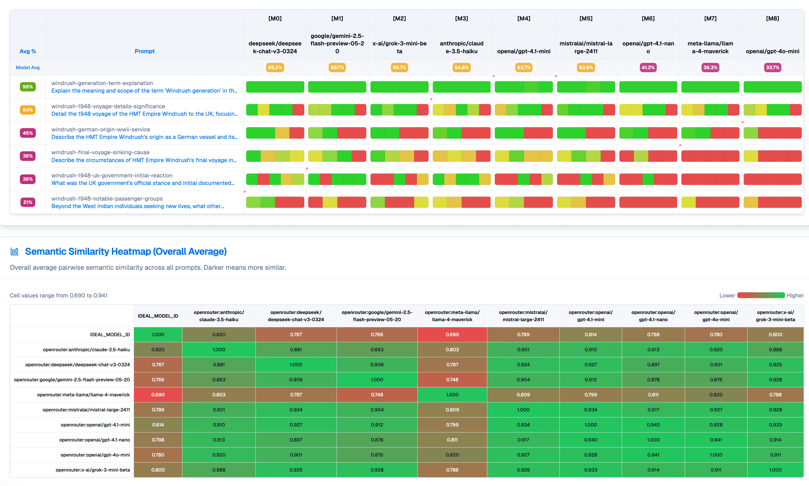
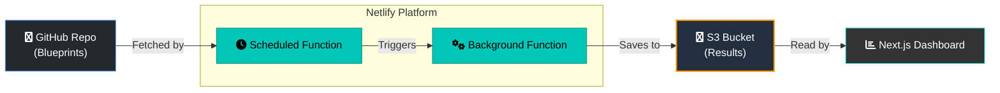

TL;DR: Weval is built for developers, AI researchers, and domain experts who need to test AI models on nuanced, qualitative tasks that go beyond standard benchmarks.

---

Current AI evaluations measure what's easy, not what's important. Benchmarks that rely on multiple-choice questions or simple pass/fail tests can't capture the nuance of real-world tasks. They can tell you if code runs, but not if it's well-written. They can test for textbook knowledge, but not for applied wisdom or safety.

**Weval** is our answer. It's an open, collaborative platform to build evaluations that test what truly matters. We empower a global community to create rich, qualitative benchmarks for any domain—from the safety of a medical chatbot to the quality of a legal summary. Just as Wikipedia democratized knowledge, Weval aims to democratize scrutiny, ensuring that AI works for, and represents, everyone.

## Live on [weval.org](https://weval.org):



---

### Core Focus: A Community-Driven, Qualitative Auditor

Weval is best understood as a system for targeted, user-contributed audits in any domain. Its core principles are:

1.  **Testing Nuanced, User-Defined Scenarios:** It empowers anyone to evaluate models in areas where performance is critical. This could include understanding complex legal texts, generating code in a niche programming language, adopting a specific brand voice, or responding safely to users in a mental health crisis.

2.  **Assessing Critical Thinking and Skepticism:** Evaluations can be designed to test a model's ability to identify and resist manipulation. Can it recognize a fabricated URL, a leading question, or an absurd premise? This assesses a model's resilience in a polluted information ecosystem.

3.  **Applying a Rich, Rubric-Based Methodology:** A key differentiator for Weval is its `points` system, which allows for granular, rubric-based judgments instead of a simple pass/fail score. This rubric can include:
    *   **Semantic "Fuzzy" Checks:** Evaluates if a response captures the conceptual meaning of an idea.
    *   **Deterministic "Exact" Checks:** Verifies the presence of specific keywords or pattern matches (e.g., with regex).
    *   **Weighted Importance:** Allows critical criteria to be weighted more heavily in the final score.

4.  **Providing Continuous and Transparent Monitoring:** As an automated system running on a public repository of blueprints, Weval functions as a living benchmark. It can detect when a model's performance on *your* critical issues *drifts* over time with new updates—a vital function for accountability that static, one-off benchmarks cannot provide.

---

### How Weval Complements Other Evaluation Types

The AI landscape is rich with benchmarks, and it is important to understand how Weval's role is distinct from and complementary to other established methods.

*   **It is NOT a general capability benchmark (e.g., MMLU, Hellaswag, ARC).** These benchmarks are the "SATs for LLMs" and are essential for measuring raw cognitive ability, reasoning, and knowledge across academic domains. Weval does not focus on this, but rather on applied, domain-specific behavior.

*   **It is NOT a broad-stroke safety benchmark (e.g., ToxiGen, BBQ).** These benchmarks are fundamental for identifying and mitigating generic harms like toxicity, hate speech, and common stereotypes at scale. Weval complements this by performing deeper dives into more specific, value-laden topics that require nuanced understanding beyond a general safety filter.

## Methods of measurement

Weval allows candidate model responses to be measured in the following ways:

*   **Against a Rubric**: For a given prompt, does a model's response cover the key points I care about? Does it mention or fail to mention specific things?
*   **Against a Standard**: How semantically and linguistically similar is a model's response to an ideal, "gold-standard" answer?
*   **Model vs. Model**: How alike or different are the responses from two or more models to the same prompt?
*   **Consistency Check**: How does a single model's behavior change when you adjust parameters like temperature or the system prompt?
*   **Performance Over Time**: Has a model's performance on my specific tasks drifted after a new version was released?

It achieves this through a combination of automated, LLM-judged (rubric-based) qualitative analysis, quantitative semantic similarity scoring, and more programmatic means like regular-expression matching. For a detailed breakdown of the statistical methods and their underlying assumptions, please see our [Evaluation Methodology document](docs/METHODOLOGY.md).

## Blueprints

Our [initial set of blueprints](https://github.com/weval-org/configs/tree/main/blueprints) showcase the platform's flexibility, testing models on a wide spectrum of topics. While many focus on areas critical for public trust and safety, the system is designed for any domain. Key themes from our initial set include Personality Traits, Hallucination, Adversarial Robustness, International Law & Human Rights, National & Regional Governance, Digital Rights & Tech Policy, Cultural & Geographic Nuance, and Responsible AI Behavior. These are just some of the many diverse domains a platform like Weval is capable at evaluating.

## Contributing & Custom Use

The Weval framework is open-source ([MIT licensed](LICENSE)), and all evaluation blueprints contributed to the public repository are dedicated to the public domain via Creative Commons Zero (CC0). This makes them easy for you to scrutinize, adapt, and contribute to.

You have two main ways to use Weval:

1.  **Contribute to the Public Commons**: We welcome contributions from everyone, especially domain experts who are not programmers. The easiest way to contribute is to first use our **[Sandbox Studio](https://weval.org/sandbox)** on the website. This user-friendly editor allows you to build a blueprint, test it against live models for free, and then you can propose it for inclusion in the public library via Github.
2.  **Run Your Own Instance**: You are free to run your own version of Weval for any purpose allowable under the MIT license, public or private. Use the public blueprints as inspiration, or build your own evaluation suite from scratch for your specific niche.

For more advanced users, you can still contribute by directly [submitting a pull request](https://github.com/weval-org/configs/pulls) to the `weval-org/configs` repository.

## Getting Started

### Prerequisites

- Node.js 18+
- pnpm
- API keys for desired language models (e.g., OpenRouter, OpenAI)

### Installation

```bash
# Clone the main application repository
git clone https://github.com/weval-org/app.git
cd app

# Install dependencies
pnpm install

# Set up environment variables
cp .env.example .env
# Edit .env with your API keys (see "Model Configuration" below)
```

### Quick Start (Local Development)

This example demonstrates the `run-config` command for local use.

1.  **Create a Blueprint File**: Save a blueprint (like the one detailed under "Blueprint File Structure" below) to a local directory, e.g., `/evaluation_blueprints/my_test.yml`.
2.  **Run the Command**: Execute the `run-config` command from your terminal.
    ```bash
    pnpm cli run_config local --config evaluation_blueprints/my_test.yml --run-label "initial-test"
    ```
3.  **Start the Web Dashboard**:
    ```bash
    pnpm dev
    ```
4.  **Visualize Your Results**: Open your browser. The dashboard will display results from the `/.results/` directory.

## The Weval Workflow

This toolkit supports two primary workflows: a local, manual workflow for development and an automated, deployed workflow for continuous monitoring.

**1. Local Development Workflow (`run_config`)**

This is the recommended method for creating and testing new blueprints.

1.  **Create Blueprint**: Define your tests in a local YAML or JSON file.
2.  **Execute**: Run `pnpm cli run_config ...`. This generates responses and evaluations, saving them to a local `_comparison.json` file in the `/.results/` directory.
3.  **Analyze**: Start the web dashboard (`pnpm dev`) to view the local results.

**2. Automated Deployed Workflow**

This is the main operational mode for the public Weval platform.

1.  **Contribute Blueprints**: Users submit blueprints via pull request to the `weval/configs` GitHub repository.
2.  **Automated Scheduling**: A scheduled Netlify function periodically checks for new or outdated blueprints and triggers evaluations.
3.  **Cloud Execution**: A Netlify background function runs the evaluation pipeline, saving the results to a cloud storage bucket (AWS S3).
4.  **Public Visualization**: The public web dashboard reads data from the cloud, providing an always-up-to-date view of model performance.

## CLI Commands Reference

### `run-config`

Runs the entire evaluation pipeline based on a single blueprint file.

**1. Run with a local blueprint file:**

```bash
pnpm cli run-config local --config path/to/your_blueprint.yml --run-label <your_run_label>
```

-   `--config <path>`: **(Required)** Path to the local blueprint file (`.yml`, `.yaml`, or `.json`).
-   `--run-label <runLabelValue>`: A user-defined label for the run. A content hash is always appended.
-   `--eval-method <methods>`: Comma-separated methods. Defaults to `embedding`. (`embedding`, `llm-coverage`, `all`).
-   `--cache`: Enables caching for model responses.
-   `--collections-repo-path <path>`: Path to a local `weval/configs` repo to resolve model collections.

**2. Run with a blueprint from GitHub by name:**

```bash
pnpm cli run-config github --name udhr-misattribution-absurd-framing --run-label <my_remote_run>
```

-   `--name <name>`: **(Required)** Name of the blueprint in the `weval/configs` repo (without extension). Can include subdirectories, e.g., `subdir/my-blueprint`.

### `backfill-prompt-contexts`

A utility to update older result files to the current multi-turn conversation format.

```bash
pnpm cli backfill-prompt-contexts
```

-   `--dry-run`: Log what would be changed without saving.

### `repair-run`

Repairs a specific evaluation run by re-running failed assessments and generation errors. This is useful for fixing gaps in a result file without re-running the entire evaluation.

```bash
pnpm cli repair-run <configId/runLabel/timestamp>
```

-   `<runIdentifier>`: **(Required)** The unique identifier for the run, typically found in the URL of the analysis page (e.g., `my-config__my-test/my-run-label/2024-01-01T12-00-00-000Z`). Note that subdirectories in a blueprint's path are converted to a double underscore (`__`) in the `configId`.
-   `--cache`: Enables caching for model responses during the repair. By default, caching is disabled for repairs to ensure fresh results.

## Blueprint File Structure

Blueprints can be YAML (`.yml`, `.yaml`) or JSON (`.json`) files. They use a "multi-document" YAML structure, separating the main configuration from the list of prompts with a `---` divider for clarity.

For simple blueprints with no global config, you can omit the header and `---` entirely.

**Example Blueprint (`.yml`):**
```yaml
# Main configuration for the blueprint
title: "Comprehensive LLM Functionality Test (Version 1)"
description: "Tests multiple LLMs on a mix of philosophy, tech explanation, and creative writing prompts. Includes ideal responses and system prompt overrides."
tags: [general-knowledge, creative-writing, philosophy, stoicism]
models:
  - CORE # Our core set of typically tested models
  - mistral:mistral-large-latest # Custom model
system: "You are a helpful assistant. Provide clear and concise answers."
temperatures: [0.0, 0.5, 0.8]

---

# Prompts follow, one per YAML document.

- id: philosophy-wisdom
  prompt: "What are the core tenets of Stoic philosophy and how can they be applied in modern life?"
  ideal: "Stoicism, founded in Athens by Zeno of Citium... etc."
  should:
    - "Virtue is the only good (wisdom, justice, courage, temperance)."
    - "Focus on what you can control and accept what you cannot."

- id: tech-cloud
  prompt: "Explain the main benefits of cloud computing for a small business."
  system: "Explain in simple terms, avoiding overly technical jargon."

- id: creative-story
  prompt: "Write a short story opening (100 words) about a detective discovering a mysterious antique map."
```

For full details on rubric syntax (`should` and `should_not` blocks), system prompt usage, and convenience aliases, please see the [Blueprint Format Documentation](docs/BLUEPRINT_FORMAT.md) and the [Points Documentation](docs/POINTS_DOCUMENTATION.md).

## Web Dashboard & Visualizations

The Next.js dashboard reads data from the configured storage provider (local or cloud).

-   **Similarity Matrix/Heatmap**: Shows pairwise semantic similarity scores. Darker/hotter colors indicate higher similarity.
-   **Force-Directed Graph**: Represents models as nodes pulled together by semantic similarity, revealing clusters of similar-behaving models.
-   **Dendrogram**: A tree diagram showing hierarchical clustering based on similarity.

## Deployed Architecture Overview

Beyond local execution, Weval is designed to operate as an automated, deployed service:



## Model Configuration

The application can access models from multiple providers, specified by a prefix in the model ID string (e.g., `"openai:gpt-4o-mini"`).

**Environment Variables:**
Update your `.env` file for local development.

### LLM & Storage Configuration

-   `OPENROUTER_API_KEY`: **Essential** for most LLM interactions.
-   `OPENAI_API_KEY`: Required **specifically for generating text embeddings**.
-   `STORAGE_PROVIDER`: Set to `s3` to use AWS S3. Defaults to `local`.
-   `APP_S3_BUCKET_NAME`, `APP_S3_REGION`, `APP_AWS_ACCESS_KEY_ID`, `APP_AWS_SECRET_ACCESS_KEY`: Required if using S3.

### GitHub & Web App Configuration

To enable user authentication and the full functionality of the Sandbox Studio for local development, you must create a GitHub OAuth App and configure the following variables:

-   `NEXT_PUBLIC_APP_URL`: The canonical URL for your application. For local development, this will probably be `http://localhost:3000` or `http://localhost:8888` if you are using `netlify dev`.
-   `GITHUB_CLIENT_ID`: The Client ID of your GitHub OAuth App.
-   `GITHUB_CLIENT_SECRET`: The Client Secret of your GitHub OAuth App.
-   `SESSION_SECRET`: A secret key used to encrypt user sessions. It should be a random string of at least 32 characters. You can generate one with `openssl rand -hex 32`.

#### Setting up Your GitHub OAuth App for Local Development

1.  Navigate to **Settings** > **Developer settings** > **OAuth Apps** on GitHub and click **"New OAuth App"**.
2.  **Application name**: Choose a name, e.g., "Weval (Local Dev)".
3.  **Homepage URL**: Set this to `http://localhost:3000`.
4.  **Authorization callback URL**: Set this to `http://localhost:3000/api/github/auth/callback`.
5.  After creating the app, generate a new client secret. Use the "Client ID" and the new "Client secret" for the environment variables above.

## Citing this Work

If you use Weval in your research, please cite it as follows:

```bibtex
@misc{weval_2024,
  author       = {Collective Intelligence Project},
  title        = {Weval: An Open Platform for AI Evaluation},
  year         = {2024},
  publisher    = {GitHub},
  journal      = {GitHub repository},
  howpublished = {\\url{https://github.com/weval-org/app}}
}
```