# Weval Architecture and Data Flow

The following diagram provides a comprehensive overview of the entire Weval pipeline, from the initial blueprint definition to the final visualization of results. It illustrates the core processing stages, including the permutation loops that allow for comprehensive testing across different models, system prompts, and temperature settings.

```mermaid
graph TD;
    %% Styles
    classDef input fill:#e6f2ff,stroke:#b3d9ff,stroke-width:2px;
    classDef process fill:#e0f7e0,stroke:#a3e0a3,stroke-width:2px;
    classDef loop fill:#fffbe6,stroke:#ffea80,stroke-width:2px,color:black;
    classDef data fill:#f2f2f2,stroke:#ccc,stroke-width:2px;
    classDef eval fill:#fff2e6,stroke:#ffddb3,stroke-width:2px;
    classDef llm fill:#fce8e6,stroke:#f8c5c0,stroke-width:2px;
    classDef score fill:#e6e6fa,stroke:#b3b3e6,stroke-width:2px;
    classDef final fill:#d4edda,stroke:#78c885,stroke-width:2px;

    %% --- 1. Blueprint Definition & Parsing ---
    subgraph "1: Input & Parsing"
        A[/"fa:fa-file-code Blueprint.yml"/]:::input;
        B["weval run-config"]:::process;
        C["Parse & Normalize Blueprint"]:::process;
        A --> B --> C;
    end

    %% --- 2. Execution & Evaluation ---
    subgraph "2: Execution & Evaluation"
        subgraph "Permutation Loops"
            direction LR
            LoopSys["For each<br>System Prompt"]:::loop;
            LoopTemp["For each<br>Temperature"]:::loop;
            LoopModel["For each<br>Model"]:::loop;
            LoopPrompt["For each<br>Prompt"]:::loop;
            C --> LoopSys --> LoopTemp --> LoopModel --> LoopPrompt;
        end
        
        subgraph "Single Evaluation Run (for one permutation)"
            D["Generate Response"]:::llm;
            LoopPrompt --> D;
            E(("<div style='font-weight:bold'>Generated Model Response</div>")):::data;
            D --> E;
            
            E_split(( ))
            style E_split fill:#fff,stroke:#fff
            E --> E_split
    
            subgraph "Method 1: Semantic Similarity (embeddings)"
                H["Text Embedding Model<br>(Default: OpenAI ada-002)"]:::llm;
                I["Calculate Cosine Similarity<br>(vs. 'ideal' response)"]:::eval;
                J[("Similarity Score")]:::score;
                E_split --> H --> I --> J;
            end
    
            subgraph "Method 2: Rubric Coverage (llm-coverage)"
                K{{"For each rubric point..."}}:::input;
                E_split --> K;
    
                subgraph "Path A: Deterministic Check"
                    L{"Is point a function?<br>e.g., '$contains', '$match', '$js'"}
                    M["Execute Function<br>(regex, word count, etc.)"]:::eval;
                    N[("Point Score: 0.0-1.0")]:::score;
                    L -- Yes --> M --> N;
                end
    
                subgraph "Path B: Conceptual 'Fuzzy' Check"
                    O{"Is point text-based?"}
                    P["Prompt Judge LLM<br>(with response + point)"]:::llm;
                    Q["Judge classifies on 5-point scale<br>(Absent, Partial, Full, etc.)"]:::eval;
                    R["Map classification to score<br>(0.0 to 1.0)"]:::eval;
                    S[("Point Score: 0.0-1.0")]:::score;
                    O -- Yes --> P --> Q --> R --> S;
                end
                
                K --> L & O;
    
                T["Aggregate Point Scores<br>(Weighted Average)"]:::eval;
                U[("avgCoverageExtent Score")]:::score;
                N --> T;
                S --> T;
                T --> U;
            end
        end

        V["Store Individual Result (Similarity + Coverage)"]:::data;
        J --> V;
        U --> V;
    end

    %% --- 3. Final Aggregation & Storage ---
    subgraph "3: Final Aggregation & Storage (after all loops)"
        W["Calculate Hybrid Scores<br>For each completed run"]:::eval;
        X[/"<div style='font-weight:bold'>Result.json File</div><br/>- Contains ALL permutation results"/]:::final;
        Y["Update Summary Statistics<br>(Drift, Rankings, etc.)"]:::process;
        Z["fa:fa-aws S3 Bucket / Local Storage"]:::data;
        AA["fa:fa-chart-bar Next.js Dashboard"]:::process;
        
        V --> W --> X --> Y --> Z --> AA;
    end
``` 

