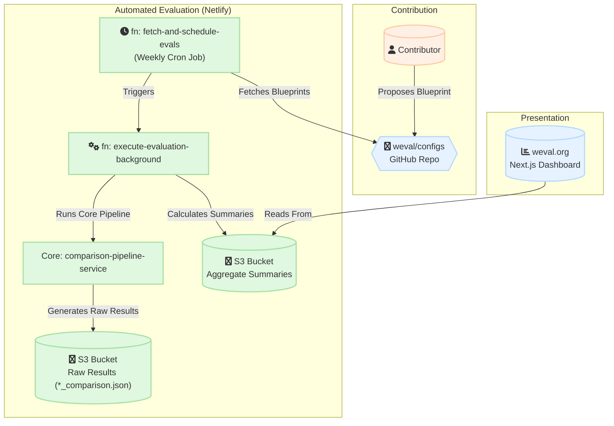
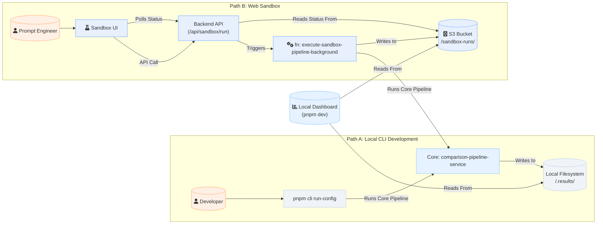
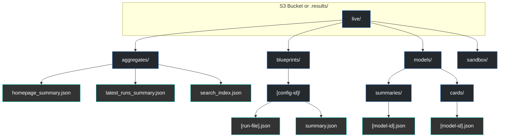
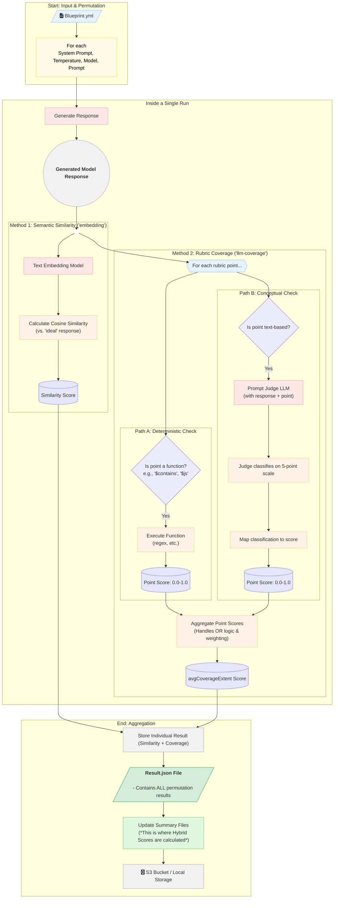

# Weval Architecture and Data Flow

This document provides a comprehensive overview of the Weval architecture, detailing the distinct workflows that power the platform and the core components that drive evaluation.

The system is designed around two primary use cases:
1.  **The Automated "Public Commons" Workflow**: A continuous integration pipeline that automatically evaluates community-contributed blueprints and updates the public `weval.org` website.
2.  **The Interactive "Developer & Sandbox" Workflow**: A set of tools for developers and prompt engineers to create, test, and iterate on blueprints either locally or in a web-based environment.

## 1. High-Level Workflows

The following diagrams illustrate the two main operational flows of the platform.

### The Automated "Public Commons" Workflow

This workflow describes how community contributions are automatically evaluated and published.

### The Interactive "Developer & Sandbox" Workflow

This workflow shows the parallel paths for local CLI development and web-based Sandbox use. Both are powered by the same core evaluation engine.

## 2. Component Deep Dive

Each component in the diagrams above has a specific role in the ecosystem.

### Core Services (Shared Logic)
These are the foundational services used across all workflows, ensuring evaluation consistency.
-   **`comparison-pipeline-service.ts`**: The central orchestrator that manages a single evaluation run. It takes a configuration, generates model responses, and calls the necessary evaluators.
-   **`llm-coverage-evaluator.ts`**: Implements the rubric-based scoring logic. It uses "judge" LLMs to assess responses against the `should` and `should_not` criteria defined in a blueprint. It supports complex rubrics including alternative paths (OR logic), where the best-performing path is selected.
-   **`storageService.ts`**: A critical abstraction layer that handles all file I/O, allowing the system to seamlessly read and write from either the local filesystem or a cloud provider like AWS S3.
-   **`summaryCalculationUtils.ts`**: Contains the post-processing logic for calculating aggregate metrics like the **Hybrid Score**, model performance drift, and leaderboard rankings. This service operates on completed raw result files.

### Storage Architecture (The `live/` Directory)
All active application data is stored within a single, top-level `live/` directory inside the configured storage provider (either local `.results/` or the S3 bucket). This centralized approach simplifies data management, backup, and restoration.

The structure inside `live/` is organized by data type:

-   **`live/aggregates/`**: Contains all global, cross-cutting summary files.
    -   `homepage_summary.json`: The main manifest for the website's homepage.
    -   `latest_runs_summary.json`: A list of the 50 most recent evaluation runs.
    -   `search_index.json`: The pre-compiled index for the website's search functionality.
-   **`live/blueprints/`**: Contains the core evaluation data, organized by each blueprint's unique ID. Each subdirectory contains the raw JSON outputs for every run of that blueprint, plus a `summary.json` of its historical performance.
-   **`live/models/`**: Contains data aggregated on a per-model basis.
    -   `summaries/`: Detailed performance breakdowns for each model across all blueprints.
    -   `cards/`: The high-level, qualitative "Model Cards" generated for model families.

-   **`live/blueprints/[config-id]/[runLabel]_[timestamp]/`** – *Artefact-Based Run Layout* (Introduced 2025-08-07)
    -   `core.json`   → Lightweight "above-the-fold" payload.  Keeps:
        - config metadata, promptIds, effectiveModels
        - similarityMatrix
        - executiveSummary
        - thin `llmCoverageScores` (avgCoverageExtent, keyPointsCount, optional stdDev/sampleCount and **lightweight pointAssessments – no text**)
        - **Place-holders** for bulky fields (`allFinalAssistantResponses`, `fullConversationHistories`)
    -   `responses/`     → prompt-level final assistant responses split by prompt (`responses/[promptId].json`).
    -   `coverage/`      → per-prompt × model rubric evaluations (`coverage/[promptId]/[modelId].json`).
    -   `histories/`     → per-prompt × model full conversation histories (`histories/[promptId]/[modelId].json`).
    -   *(Legacy)* `[runLabel]_[timestamp]_comparison.json` – the original monolithic file is still generated for backward compatibility but will be phased out.

  The application fetches `core.json` via `/api/comparison/.../core` to render the page instantly.  Detailed data is lazy-loaded on demand from `responses/` and `coverage/` paths, with automatic fallback to the legacy monolithic file when artefacts are missing.

#### Fixtures (Optional deterministic responses)

- When the CLI is invoked with `--fixtures`, the generation stage consults a fixtures file (YAML/JSON) to select deterministic candidate responses for specific prompt×model pairs.
- For multi-turn prompts with `assistant: null` placeholders, fixtures can provide a `turns` array to fill those generated assistant turns in order.
- `core.json` continues to contain placeholders for responses and histories by design; the concrete texts are persisted under `responses/` and `histories/` regardless of fixtures usage.

-   **`live/sandbox/`**: Dedicated, isolated area for temporary data generated by the web-based Sandbox Studio.

### Automated Workflow Components
These components power the public `weval.org` platform.
-   **`fn: fetch-and-schedule-evals`**: A Netlify cron job that runs weekly. It scans the `weval/configs` repository for new or updated blueprints with the `_periodic` tag and triggers evaluation runs for them.
-   **`fn: execute-evaluation-background`**: The Netlify background function that performs the actual evaluation for the public site. It calls the core services and is responsible for creating both the raw result file and updating the aggregate summary files in S3.

### Interactive Workflow Components
These components support the developer and sandbox environments.
-   **`cli: run-config`**: The main command-line tool for developers. By default, it runs the evaluation pipeline for a local or GitHub-based blueprint and saves the results to the local `/.results/` directory, updating only the per-config summary. When used with the `--update-summaries` flag, it additionally rebuilds platform-wide summaries (homepage leaderboards, model summaries, etc.) using the same logic as the backfill process.
-   **Sandbox UI & Backend API**: A full-stack feature within the Next.js app that provides an interactive, browser-based IDE for blueprint creation. It has its own set of API endpoints (`/api/sandbox`, `/api/github`) and a dedicated background function (`fn: execute-sandbox-pipeline-background`) for running evaluations.

## 3. Deep Dive: The Core Evaluation Pipeline

This diagram provides a granular, step-by-step view of what happens inside the `comparison-pipeline-service` during a single evaluation run for one prompt permutation.

## 4. Key Architectural Concepts

-   **Separation of Raw Data and Summaries**: The core pipeline still produces a monolithic `*_comparison.json` for complete fidelity, *but* the UI now relies on the artefact bundle (`core.json` + `responses/` + `coverage/`) for 95 % of use-cases.  High-level metrics like the **Hybrid Score** are *not* in either raw form; they are computed afterward by `summaryCalculationUtils.ts` and saved into summary files (e.g. `homepage_summary.json`).
-   **Consistency via Shared Services**: By using the same core services (`comparison-pipeline-service`, `storageService`, etc.) for both the automated Netlify workflow and the manual CLI/Sandbox workflow, the platform ensures that an evaluation produces the same results regardless of how it was triggered.
-   **Idempotent, Content-Hashed Runs**: The automated workflow uses a hash of a blueprint's content (including its fully resolved model list) as its `runLabel`. This ensures that identical blueprints are not re-run unnecessarily, saving significant computational resources.
-   **Graceful Fallback & Progressive Enhancement**: The Sandbox is a prime example of this design principle. It is fully functional for anonymous users, with all work saved to local storage. Authenticating with GitHub progressively enhances the experience by enabling cloud-based file management and the ability to contribute back to the public commons.