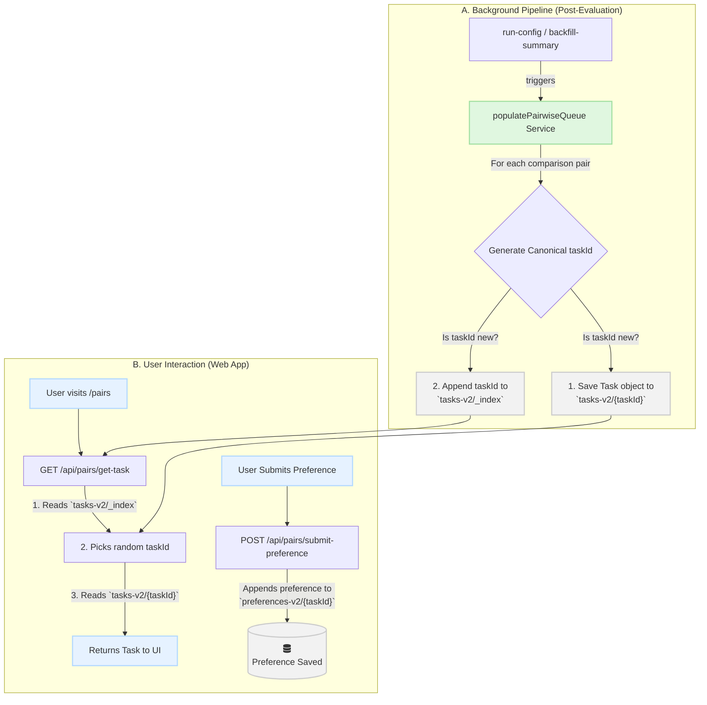

# Pairs: Human Preference Collection System

This document provides a comprehensive technical overview of the architecture, data flow, and implementation details for the "Pairs" feature, which is designed to collect human preference data on AI model responses.

## 1. Introduction & Core Philosophy

The "Pairs" feature is a system for collecting pairwise human preference data. For a given prompt and two model responses (A and B), it allows a user to state which response they prefer and why.

The core design principle is to create a rich, **agnostic dataset** of human judgments. This means the collected preference data is intentionally decoupled from any single evaluation run. A comparison pair is judged on its own merits—the prompt, the system prompt, and the two responses—not on the context of the specific run it originated from. This allows the dataset to accumulate value over time and be used for many different types of downstream analysis (e.g., ELO ranking, identifying common failure modes) that are independent of the original evaluation's goals.

## 2. Architecture: The "Task Directory" Model

To handle a potentially massive number of unique comparison pairs without sacrificing performance, the system uses a "Task Directory" model instead of a single, monolithic queue file. This approach treats the blob store like a key/value directory, ensuring that both reading and writing operations are fast and memory-efficient.

### Data Stores

The system relies on two distinct Netlify Blob stores:

-   **`pairwise-tasks-v2`**: This store holds the individual comparison tasks.
    -   Each unique task is stored as a separate JSON object.
    -   The key for each object is its **Canonical Task ID**.
    -   A special `_index` file within this store contains a simple JSON array of all available Task IDs. This lightweight index is the key to fast task retrieval.
-   **`pairwise-preferences-v2`**: This store holds the user-submitted preferences.
    -   Each entry is keyed by the **Canonical Task ID** of the comparison the user judged.
    -   The value is a JSON array of all preference records submitted for that specific task, allowing multiple users to judge the same pair over time.

### Canonical Task ID

To ensure data integrity and effective de-duplication, every comparison pair is identified by a unique, canonical `taskId`. This ID prevents the same pair from being added to the queue multiple times.

The ID is generated by creating a **single, stable key** and then hashing it:

1.  The following components are collected:
    -   The `promptId` from the evaluation blueprint.
    -   The two model IDs being compared (e.g., `openai:gpt-4` and `anthropic:claude-2`).
    -   The full text content of both model responses.
2.  These five strings are placed into an array, which is then **sorted alphabetically**.
3.  The sorted array is joined into a single string using a `|` delimiter.
4.  The final `taskId` is the **SHA256 hash** of this resulting string.

This process guarantees that the same comparison is treated as a single entity, regardless of which run it came from or whether the models were presented as A/B or B/A.

### Data Flow Diagram



## 3. Implementation Deep Dive

### Task Generation (Backend)

-   **Service**: `src/cli/services/pairwise-task-queue-service.ts`
-   **Function**: `populatePairwiseQueue`
-   **Process**: This service is the engine for creating tasks. This process is only triggered automatically for blueprints that contain the `_get_human_prefs` tag in their configuration.
    1.  It is triggered at the end of an evaluation run (`run-config`) or during a historical backfill (`backfill-summary`).
    2.  When triggered by `run-config`, it processes the results of that single new run. For the `backfill-summary` command, it is configured to only process the **single latest run** of each blueprint.
    3.  **Anchor Model Strategy**: To avoid generating a huge number of pairs, the service uses a permanent **anchor model**: `openrouter:openai/gpt-4.1-mini`.
    4.  For each prompt in a run, it checks if the anchor model is present.
        -   **If anchor is present**: It generates a comparison pair for *every other model vs. the anchor model*. This creates a linear, manageable number of high-quality pairs.
        -   **If anchor is NOT present**: It logs a warning and **skips generating pairs for that prompt**. This "strict mode" enforces data consistency and prevents low-quality comparisons from entering the queue.
    5.  For each valid pair, it computes the canonical `taskId`.
    6.  It reads the `_index` file to build a `Set` of existing task IDs for efficient de-duplication.
    7.  For any new task, it saves the `PairwiseTask` object (including `modelIdA` and `modelIdB` fields) to the store and appends the new `taskId` to the index.

#### PairwiseTask Data Structure

```typescript
interface PairwiseTask {
  taskId: string;
  prompt: {
    system: string | null;
    messages: ConversationMessage[];
  };
  responseA: string;
  responseB: string;
  modelIdA: string;  // Added for model reveal feature
  modelIdB: string;  // Added for model reveal feature
  configId: string;
}
```

### API Endpoints (Backend)

-   **`GET /api/pairs/get-task`** (`src/app/api/pairs/get-task/route.ts`): This endpoint is designed for speed.
    1.  It makes one cheap request to fetch the `_index` file.
    2.  It selects a random `taskId` from the array in memory.
    3.  It makes a second cheap, direct lookup to fetch the full task object by its key.
    4.  It returns the task to the client.

-   **`POST /api/pairs/submit-preference`** (`src/app/api/pairs/submit-preference/route.ts`): This endpoint handles user submissions.
    1.  It receives the `taskId`, the user's `preference` (`A`, `B`, `Indifferent`, or `Unknown`), and an optional `reason`.
    2.  It uses the `taskId` as the key to read the corresponding record from the `pairwise-preferences-v2` store.
    3.  It appends the new preference record to the array of existing records (or creates a new array if none exist).
    4.  It saves the updated array back to the store.

### Data Collection UI (Frontend)

-   **Location**: `src/app/pairs/page.tsx`
-   **Component**: The page uses a client-side component, `PairwiseComparisonForm`, to manage the interactive state.

#### User Interface Flow

The UI implements a clear three-phase interaction pattern:

**1. Selection Phase**
-   User reads the prompt (with collapsible system prompt if present)
-   User reads both Response A and Response B
-   Responses are **randomly positioned** (left/right) to eliminate position bias
-   Long responses (>1000 chars) are shown in scrollable areas with expand/collapse functionality
-   User clicks "Select A" or "Select B" button
-   **Visual Feedback**:
    -   Selected button changes from outline to solid style with ring highlight
    -   Button text changes to "A Selected" / "B Selected" with check icon
    -   Selected response card gains a ring border
    -   User can change selection before submitting (not permanent)

**2. Reasoning Phase (Optional)**
-   Reasoning section appears only after A or B is selected
-   Displays clear message: "You selected Response X"
-   **Quick Reason Templates**: 8 clickable badge options for common reasons:
    -   More concise, Better accuracy, Clearer explanation, More creative
    -   Safer response, More helpful, Better structured, More thorough
-   **Free-text area**: Optional additional explanation
-   Templates and text are combined into the final reason

**3. Submission Phase**
-   Large "Submit My Choice" button appears in reasoning section
-   User explicitly confirms their selection
-   On submission:
    -   Model IDs are revealed briefly beneath each response
    -   Session progress counter updates
    -   Toast notification confirms submission
    -   Next task loads after 2-second delay

#### Alternative Actions (Always Available)

Three alternative buttons are always visible below the main responses:

1.  **"About the Same"** (Yellow/amber button)
    -   For responses of equal quality
    -   Submits as `Indifferent` preference
    -   Immediate submission (no reasoning section)

2.  **"I Don't Know"** (Secondary button)
    -   For when user lacks expertise to judge
    -   Submits as `Unknown` preference
    -   Immediate submission

3.  **"Skip This Comparison"** (Outline button)
    -   For when user wants to move on without submitting
    -   No data submitted, fetches next task immediately

#### Accessibility Features

-   All interactive elements are proper semantic buttons
-   ARIA labels on all buttons (`aria-label`, `aria-pressed`)
-   Keyboard-navigable template badges (Enter/Space to toggle)
-   Focus indicators on all interactive elements
-   Screen reader announcements for state changes
-   Collapsible system prompt has proper `aria-expanded` state

#### Technical Implementation

1.  On page load, it calls `GET /api/pairs/get-task` to fetch a comparison
2.  Position randomization (A/B swap) is determined on task load
3.  Selection updates local state without immediate submission
4.  Submission sends `taskId`, `preference`, and combined `reason` to `POST /api/pairs/submit-preference`
5.  Loading and error states are handled gracefully with appropriate ARIA roles

## 4. Queue Management (CLI)

While the queue is populated automatically from runs of blueprints tagged with `_get_human_prefs`, manual control is often needed. Two CLI commands are provided for this purpose. Both commands support an optional `--site-id <netlify-site-id>` flag to target a blob store environment other than the one specified in local configuration.

### Adding Tasks to the Queue

-   **Command**: `pnpm cli add-to-pairs --config-id <id> [--site-id <netlify-site-id>]`
-   **Action**: This command retrieves the **single latest run** for the specified `<id>` and adds all of its comparison pairs to the task queue. This is useful for adding pairs from a blueprint that doesn't have the `_get_human_prefs` tag or for re-adding pairs from a specific blueprint.

### Deleting Tasks from the Queue

-   **Command**: `pnpm cli delete-from-pairs [--config-id <id> | --all] [--site-id <netlify-site-id>]`
-   **Action**: This command provides two modes for removing tasks from the queue:
    -   `--config-id <id>`: Deletes all tasks that originated from the specified blueprint ID.
    -   `--all`: Wipes the **entire** `pairwise-tasks-v2` store, including the index. It will prompt for confirmation before executing.
-   **Legacy Cleanup**: For historical reasons, the command also cleans up an older, deprecated `pairwise-tasks` store when run.

## 5. Local Development Considerations

Interacting with Netlify Blob Storage from a local development environment can be complex. To provide a seamless developer experience, the API routes for the Pairs feature use a **proxy mechanism** when running locally (`pnpm dev`).

-   **Local Behavior**: When running the app locally, the `GET /api/pairs/get-task` and `POST /api/pairs/submit-preference` endpoints do **not** connect to a local blob store.
-   **Proxy to Dev**: Instead, they make server-to-server `fetch` requests to the deployed `dev--weval-dev.netlify.app` API, retrieve the data, and pass it back to the local client.

This approach completely bypasses local blob storage complexities and potential CORS issues, allowing developers to work on the Pairs UI using a live, populated task queue from the shared development environment.

## 6. Future Work & Downstream Analysis (TODO)

Collecting preference data is the first step. The real value comes from aggregating and analyzing these judgments to produce actionable insights. The following is a recommended roadmap for building out this analysis layer.

### 1. ELO Rating Calculation (High Priority)

The most effective way to process this pairwise data is to calculate an **ELO rating** for each model. This will provide a continuous "strength" score that reflects human preference.

-   **Create a new CLI command**: `pnpm cli calculate-elo`
    -   **Input**: The command will read all records from the `pairwise-preferences-v2` blob store.
    -   **Process**:
        1.  Initialize a starting ELO score (e.g., 1500) for all models found in the data.
        2.  Iterate through every preference record for every task.
        3.  For each matchup (e.g., Model A vs. Model B), update the ELO scores of both models based on the outcome (A wins, B wins, or draw) using the standard ELO formula.
    -   **Output**: The command will save its results to a new file in the blob store, e.g., `multi/elo_ratings.json`. This file will contain a simple mapping of `modelId` to its calculated ELO score.
-   **Automation**: This command should be run on a schedule (e.g., as a daily Netlify function) to keep the ELO ratings fresh as new preferences are submitted.

### 2. Integrating ELO Scores into Analysis Pages

The calculated ELO scores should be displayed directly on the analysis results page to provide a human-centric counterpoint to the automated quantitative metrics.

-   **Modify the Analysis Page (`/analysis/...`)**:
    -   When fetching the data for a run, the page should also fetch the `multi/elo_ratings.json` file.
    -   **Add an "ELO Score" column** to the main results table.
    -   For each model in the run, look up its current ELO score and display it. This allows for direct comparison: a model might have a high "Hybrid Score" but a lower ELO, indicating a potential divergence between automated metrics and human perception.
    -   Add a tooltip to the ELO score column explaining what the score represents.

### 3. Dedicated Human Preference Dashboard

To provide a global view of model performance, a dedicated dashboard should be created.

-   **Create a new page**: `/analysis/human-preferences` or `/elo-leaderboard`.
-   **Features**:
    -   **Global ELO Leaderboard**: A ranked list of all models based on their current ELO score.
    -   **Head-to-Head Stats**: A matrix showing the win/loss/draw record for any two models (e.g., "Claude 3 Sonnet wins vs. GPT-4o Mini 58% of the time").
    -   **Historical ELO Chart**: A line chart showing how the ELO ratings of key models have changed over time.

### 4. Qualitative Analysis of Preference Reasons

The free-text "reason" field is a goldmine of qualitative data.

-   **LLM-based Clustering**: Use an LLM to process all the "reason" text for a given model matchup.
-   **Identify Common Themes**: The LLM can be prompted to categorize the reasons into themes like "More Concise," "Better Factual Accuracy," "More Creative," "Safer Response," etc.
-   **Display Insights**: This analysis can reveal *why* users prefer one model over another, providing deep insights beyond a simple score. For example: "Users prefer Model A for its creativity but prefer Model B for its accuracy."

### 5. Advanced Features & Quality of Life

-   **Confidence Intervals**: Calculate and display confidence intervals for ELO scores based on the number of "games" (judgments) each model has participated in.
-   **CLI Data Export**: Add a command `pnpm cli export-preferences` to download the raw preference data as a CSV for external analysis.
-   **Preference Browser UI**: Create a simple internal tool to browse the individual judgments and reasons submitted for any given task.

## 7. User Experience & Design

For a comprehensive walkthrough of the UI interaction patterns and user story scenarios, see [PAIRS_USER_STORIES.md](../PAIRS_USER_STORIES.md).

The current implementation supports:
-   ✅ Clear selection → reasoning → submission flow
-   ✅ Visual feedback at every interaction step
-   ✅ Error recovery (user can change selection before submitting)
-   ✅ Multiple alternative actions for different user needs
-   ✅ Full keyboard and screen reader accessibility
-   ✅ Position randomization to reduce response bias
-   ✅ Model reveal after submission for user satisfaction
-   ✅ Session progress tracking for gamification 